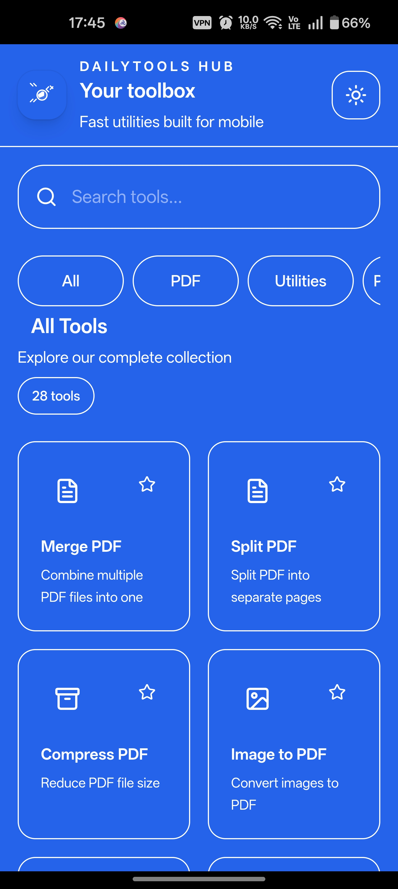
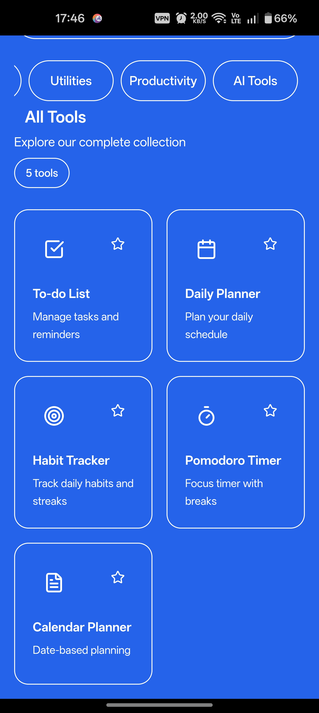
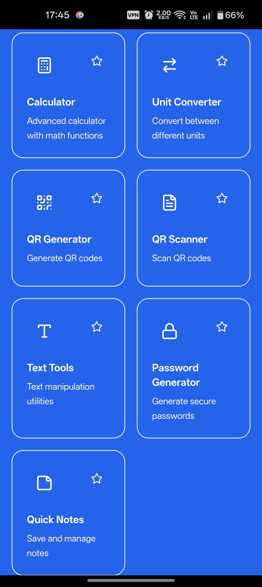

# 🚀 DailyTools Hub


🔥 **All-in-one Android utility app with 20+ powerful tools** built using React + Capacitor.

---

## 📱 App Preview

---

### 🏠 Home & Navigation

<p align="center">
  
</p>

Clean dashboard with categorized tools,

🔍 Search bar for quick access,

⚡ Smooth UI with modern design.

---

### 📄 PDF Tools

<p align="center">
  
</p>

* Merge multiple PDFs into one
* Split PDF into pages
* Compress PDF size
* Add watermark & signatures
* OCR text extraction

---

### 🤖 AI Tools

<p align="center">
  
</p>

* Text Summarizer
* Resume Generator
* Email Writer
* Chat Assistant
* Code Generator

---

### ⚡ Productivity Tools

<p align="center">
  
</p>

* To-do List
* Daily Planner
* Habit Tracker
* Pomodoro Timer
* Calendar Planner

---

### 🧰 Utilities

<p align="center">
  
</p>

* Calculator (advanced functions)
* Unit Converter
* QR Code Generator
* QR Scanner
* Password Generator
* Quick Notes

---

### 📂 File Tools

<p align="center">
  
</p>

* File Compressor (ZIP)
* Image Resizer
* Image Converter (PNG ↔ JPG)
* Document Scanner

---

### 🔧 Tool Example — Merge PDF

<p align="center">
  
</p>

📄 **Merge multiple PDF files into one** with a simple workflow:

* 📂 Select multiple files
* ✏️ Rename output file before download
* ⚡ One-click processing
* 📱 Fast & smooth mobile experience

---

### 💡 How It Works

1. Open **Merge PDF**
2. Select your PDF files
3. Enter output file name
4. Tap **Merge PDFs**
5. Download instantly 🚀

---

## ⚡ Features

* 📄 PDF Tools (Merge, Split, Compress, Watermark)
* 🧮 Unit Converter
* 🖼️ Image to PDF / Converter
* ⭐ Favorites System
* 🌙 Dark Mode Support
* 📂 Rename files before download
* 📱 Android-ready (Capacitor)
* ⚡ Fast & lightweight UI

---

## 📦 Download APK

👉 **Download Latest APK:**

➡️ https://github.com/rishik1072/DailyTools-Hub/releases

---

## 🛠️ Tech Stack

* ⚛️ React (Vite)
* 🎨 Tailwind CSS
* 📱 Capacitor (Android)
* 📦 pdf-lib

---

## 🚀 Run Locally

```bash
git clone https://github.com/YOUR-USERNAME/DailyTools-Hub.git
cd DailyTools-Hub
npm install
npm run dev
```

---

## 📱 Build APK

```bash
npm run build
npx cap sync
npx cap open android
```

Then build APK from Android Studio.

---

## 💡 Future Improvements

* ☁️ Cloud storage integration
* 🔍 OCR support
* 📄 Better PDF compression
* 🤖 Offline AI tools

---

## 👨‍💻 Author

**Rishik Gorakala**

* GitHub: https://github.com/rishik1072

---

## ⭐ Support

If you like this project, consider giving it a ⭐

---


## 📂 Project Structure

```
DailyTools-Hub/
├── android/
├── src/
├── screenshots/
├── package.json
├── README.md
└── .gitignore
```
